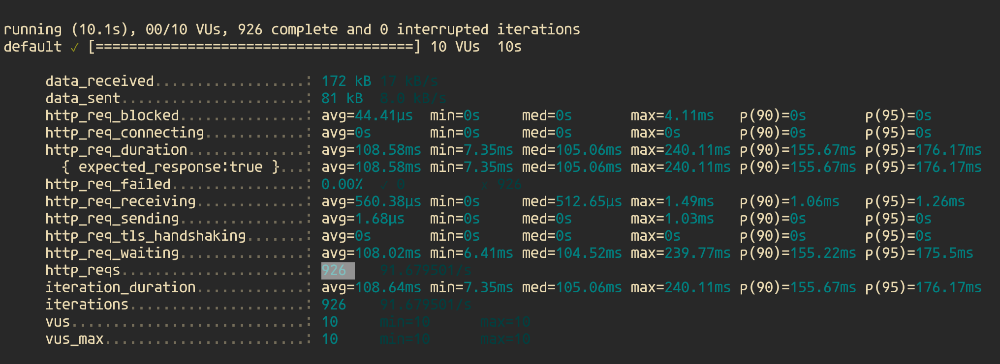
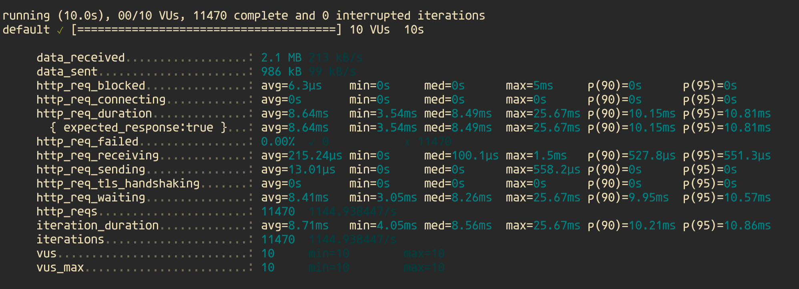

# _**CacheZilla**_

CacheZilla is a lightweight caching system ( source code is approximately only one file ) that supports `key,value` based storage and `ttl` ( time to live ).


## Example

```py
from cachezilla import CacheZilla

cache = CacheZilla() # optional: max_size

cache.set("name","kareem")
cache.set("age",20,ttl=5)

cache.get("name") # >> kareem
```

## Why CacheZilla !?

Well, i can't really convince you, but the numbers can.

### Benchmarking without caching

When a FastAPI endpoint is created without using any caching or any fancy stuff, the code looks something like this:

```py
@app.get("/without", response_model=Post)
async def without_cache(session: Session = Depends(get_session)):
    return session.exec(select(Post).where(Post.id == 1)).first()
```

when this endpoint is benchmarked using [k6](https://k6.io/), the metrics are as follows:



### Benchmarking with caching

Now, let's take an example of a FastAPI endpoint that utilizes `CacheZilla`:

```py
@app.get("/with/{post_id}", response_model=Post)
async def with_cache(post_id: int, session: Session = Depends(get_session)):
    post = cache.get(post_id)
    if post is None:
        post = session.exec(select(Post).where(Post.id == 1)).first()
        cache.set(post.id, post)
        return post
    else:
        return post
```

the metrics of this endpoint is as follows:



### Summary of benchmarks

- In a duration of 10s with 10 vus (virtual users)
  - `Without` caching: the API served `920 requests`
  - `With` caching: the API served more than `11400 requests`, which is about `12 times` the number of requests served without caching
- Request duration
  - `Without` caching: the request took an average of `108 ms`
  - `With` caching: the request took an average of `8 ms`, which is about 92% reduction in request time

## Some words about CacheZilla's infrastructure

CacheZilla, under the hood, uses `doubly-linked lists ` to keep track of the relationship between cache items, `dataclasses` to store the cache item data.
It uses the `LRU` ( Least Recently Used ) cache eviction strategy which is proven to be the most efficient amongst the other cache eviction strategies.

## Running the tests locally

First, make sure you have [Poetry](https://python-poetry.org/) installed on your machine.

Second, install the project dependencies plus the testing dependencies like this:

```sh
$ poetry install --with test
```

Now you can run:

```sh
$ pytest -s -v
```

## Trying the benchmarks locally

First, make sure you have [Poetry](https://python-poetry.org/), [Makefile](https://stackoverflow.com/questions/32127524/how-to-install-and-use-make-in-windows) and [K6](https://k6.io/) installed on your machine.

Second, navigate to the `benchmark/` directory, now run this command:

```sh
$ make setup
```

this command will created a postgres database using docker, create the tables and seed the database with a sample data and start the API server.

Now, open another terminal window and navigate to the same directory as before and run:

```sh
$ make benchmark_no_cache
```

or

```sh
$ make benchmark_cache
```

to clean after you have been done, run:

```sh
$ make clean_up
```

this will delete the docker container for you.

## Contributing

Please make sure to write unit tests for your code and make sure your code passes all the tests.

Also make sure to run the pre-commit hooks on your code.
